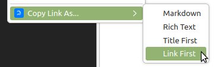
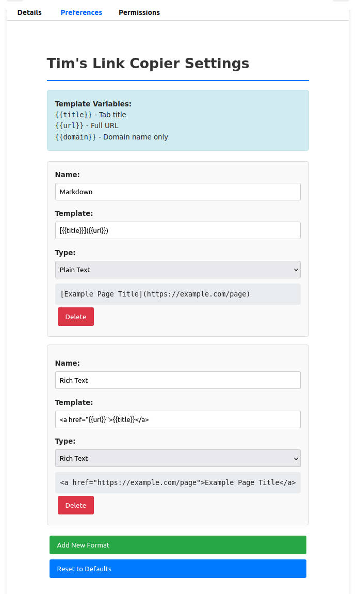

# Tim's Link Copier

A Firefox extension that allows users to copy tab links and information in multiple customizable formats through the tab context menu.

- https://addons.mozilla.org/en-US/firefox/addon/tim-s-link-copier/
- https://github.com/timabell/firefox-link-copier

## Features

- **Multiple Copy Formats**: Copy links in various formats including Markdown, Rich Text, and Plain Text
- **Customizable Templates**: Define your own copy formats with flexible template system
- **Tab Context Menu Integration**: Right-click on any tab to access copy options
- **Rich Text Support**: Paste formatted links directly into Word processors and other applications
- **Easy Configuration**: Simple interface to manage and customize copy formats

## Default Formats

- **Markdown**: `[Tab Title](URL)` - Perfect for documentation and README files
- **Rich Text**: Formatted clickable links for word processors
- **Title First**: Simple '"Tab Title" - URL' format
- **Link First**: Simple 'URL - "Tab Title"' format
- **Rich: domain**: Rich text links showing just domain name
- **Rich: domain+path**: Rich text links showing domain and path
- **Markdown: domain**: Markdown links showing just domain name  
- **Markdown: domain+path**: Markdown links showing domain and path

## Installation

### From Firefox Add-ons Store
1. Visit the [Firefox Add-ons page](https://addons.mozilla.org) (coming soon)
2. Click "Add to Firefox"
3. Confirm installation

### Development Installation
1. Clone this repository
2. Open Firefox and navigate to `about:debugging`
3. Click "This Firefox"
4. Click "Load Temporary Add-on"
5. Select the `manifest.json` file from the `src/` folder

## Usage

1. Right-click on any tab
2. Select "Copy Link As..." from the context menu
3. Choose your desired format
4. Paste anywhere you need the formatted link



*Right-click context menu showing available copy formats*

## Configuration

Access the extension options through:
- Firefox Add-ons Manager → Tim's Link Copier → Options
- Or right-click the extension icon and select "Options"



*Settings page showing customizable copy formats*

Create custom formats using template variables:
- `{{title}}` - Tab title
- `{{url}}` - Tab URL
- `{{domain}}` - Domain name only
- `{{domain_path}}` - Domain and path (no protocol/query)

## Development

### Prerequisites
- Firefox 88+ for development
- Node.js 16+ (for testing and building)
- npm or yarn

### Setup
```bash
git clone https://github.com/timabell/firefox-link-copier.git
cd firefox-link-copier
npm install
```

### Testing
```bash
npm test
npm run test:integration
```

### Building
```bash
npm run build
```

### Project Structure
```
firefox-link-copier/
├── src/                  # Extension source files
│   ├── manifest.json     # Extension manifest
│   ├── background.js     # Background script
│   ├── options.html      # Options page
│   ├── options.js        # Options page logic
│   └── icon.svg          # Extension icon
├── tests/                # Test files
├── dist/                 # Built extension packages
└── docs/                 # Documentation
```

## Contributing

1. Fork the repository
2. Create a feature branch (`git checkout -b feature/amazing-feature`)
3. Commit your changes (`git commit -m 'Add amazing feature'`)
4. Push to the branch (`git push origin feature/amazing-feature`)
5. Open a Pull Request

## License

This project is licensed under the A-GPL v3 License - see the [LICENSE](LICENSE) file for details.

## Acknowledgments

- Inspired by add-on [Copy LinkTab name and URL](https://addons.mozilla.org/en-GB/firefox/addon/copy-linktab-name-and-url/) which is very good but doesn't do rich-text copy-paste.
